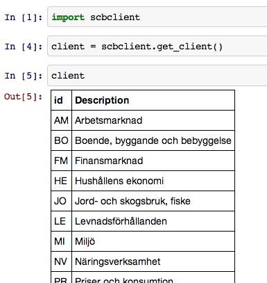
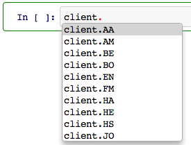
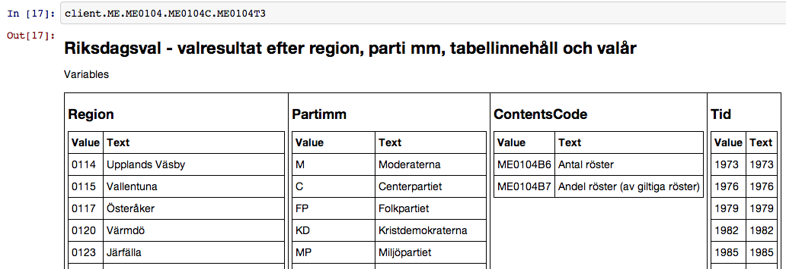
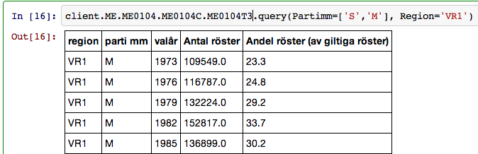

scbclient
=========

scbclient is a wrapper around the [Statistiska centralbyrån API](http://www.scb.se/api/). It makes it easy to navigate and query the API.

Examples
========
Here is how you import and explore the API.

There is also tab completion.

You can drill down the API.

And also query it.

